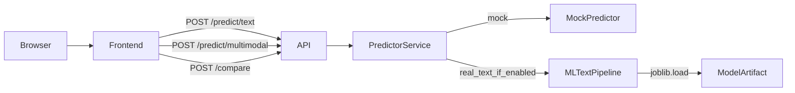

# AttentionLens — Full Repo Audit (Recruiter + Security + Prod Readiness)

This audit treats AttentionLens like a recruiter-facing “real product demo”, not a class notebook. It flags architectural inconsistencies, security posture gaps, testing/CI weaknesses, and DX smells that undermine credibility.

> Status note: The current app is a **working demo**. Several pieces are intentionally “demo-mode” (mock predictor, stubbed multimodal pipeline). This audit separates what’s acceptable in a demo vs what must be hardened for a production-quality portfolio.

---

## 1) Repo summary

- **Monorepo**: `frontend/` (Vite + React Router), `backend/` (FastAPI), `ml/` (text baseline training + inference).
- **MVP behavior**:
  - Frontend calls backend `/predict/*` and `/compare`.
  - Backend returns mock results by default (`USE_MOCK_PREDICTOR=true`), but can use a trained text baseline if present and mock is disabled.
- **Strengths**:
  - Typed backend schemas exist.
  - A real, trainable text baseline exists (sklearn) with a simple inference pipeline.
  - UX already looks “startup-ish” (Lovable UI).
- **Weaknesses**:
  - Security posture is “demo default” (CORS wildcard methods/headers, no rate limiting, weak image validation).
  - No tests, no CI, no structured logging.
  - Docs have stack drift (Next.js references remain).

---

## 2) Current architecture

### Runtime data flow

### Key entrypoints

- **Frontend**: `frontend/src/main.tsx`, `frontend/src/App.tsx`, `frontend/src/lib/api.ts`
- **Backend**: `backend/app/main.py`, routes under `backend/app/api/`
- **ML**:
  - Training: `ml/src/models/train_text_model.py`
  - Inference: `ml/src/inference/pipeline.py`

### Architectural smells

- Backend “real model” integration uses runtime `sys.path` edits (`backend/app/services/predictor.py`), which is brittle and non-idiomatic for production packaging.
- Docker compose mounts models to `/app/ml_models`, but backend defaults look for `ml/saved_models/...` under repo root, so “real model mode” is likely broken in container unless env is overridden.

---

## 3) Frontend stack and structure

### Stack

- Vite + React 18
- React Router (`react-router-dom`)
- Tailwind CSS + `tailwindcss-animate`
- Framer Motion

### Structure (current)

- Pages: `frontend/src/pages/*`
- Shared components: `frontend/src/components/*`
- API client: `frontend/src/lib/api.ts`

### Key issues (recruiter signal)

- **API networking strategy is inconsistent**:
  - Dev proxy exists in `frontend/vite.config.ts` for `/predict`, `/compare`, etc.
  - Client calls absolute `VITE_API_BASE_URL ?? http://localhost:8000` anyway.
  - This makes environments harder to reason about and invites CORS misconfig.
- **Unfinished platform UI primitives**:
  - Minimal `Toaster` / `TooltipProvider` implementations (placeholders) look like copied scaffolding.
- **Missing runtime response validation** (trusts backend JSON blindly):
  - A backend change can break the UI without a clear error.
- **A11y**:
  - Icon-only buttons missing `aria-label`.
  - Upload uses a clickable container; needs keyboard semantics.

> Recommendation: since you plan to rework Lovable UI later, do **minimum** credibility fixes now (a11y + remove placeholders), and invest most time into backend/security/workflow.

---

## 4) Backend stack and structure

### Stack

- FastAPI
- Pydantic v2 + pydantic-settings
- Uvicorn

### Routes

- `GET /health`
- `POST /predict/text`
- `POST /predict/image`
- `POST /predict/multimodal`
- `POST /compare`
- `GET /model/info`

### Issues

- **CORS is permissive** (`backend/app/main.py`):
  - `allow_methods=["*"]`
  - `allow_headers=["*"]`
  - `allow_credentials=True`
- **No rate limiting**:
  - Prediction endpoints are a DoS target, especially if/when real models are enabled.
- **Image inputs are not validated** (`backend/app/schemas/predict.py`):
  - `image_base64` / `image_url` are unconstrained strings.
  - No mutual exclusivity.
  - No size caps.
- **Silent failures** (`backend/app/services/predictor.py`):
  - `_run_text_pipeline_real` catches `Exception` and returns `None` without logging.
- **Information disclosure** (`backend/app/api/model_info.py`):
  - Exposes model paths publicly.

---

## 5) ML/inference structure

### What’s real today

- **Handcrafted text features**: `ml/src/features/text_features.py`
- **Target engineering**: `ml/src/features/target_engineering.py` (log1p + percentile scaling)
- **Trainable text model**: `ml/src/models/train_text_model.py` (sklearn GradientBoostingRegressor)
- **Text inference**: `ml/src/inference/pipeline.py` loads joblib artifact and outputs an API-friendly dict

### What is stubbed / demo-only

- Image features: `ml/src/features/image_features.py` (`NotImplementedError`)
- Multimodal pipeline: partial stub/fallback; not a real fusion model yet

### Technical debt / mismatches

- Artifact contract is loose:
  - inference hardcodes bucket thresholds and uses a placeholder confidence
  - metadata/versioning is not explicit
- “Percentile within platform/category” is described in docs, but current target engineering is global unless you explicitly group it.

---

## 6) Environment/configuration issues

- `.env.example` contains `NEXT_PUBLIC_API_URL`, which is **not used** by Vite. Vite expects `VITE_*`.
- `scripts/run_backend.sh` and `scripts/run_dev.sh` load `.env` using `export $(grep ... | xargs)`:
  - breaks with spaces/special chars
  - can accidentally export unintended variables
  - weak DX and not production-like
- No explicit `ENVIRONMENT=dev|prod` switch to harden behavior (CORS, docs availability, etc.).

---

## 7) Security findings

### P0 (must fix)

1. **CORS overly permissive** (`backend/app/main.py`)
2. **No abuse controls** (rate limiting)
3. **No payload caps for base64 image** (DoS risk)
4. **`image_url` accepted without validation** (future SSRF risk if fetched later)

### P1 (should fix)

1. **Info disclosure via `/model/info`**
2. **No structured logging / no request IDs**
3. **Silent exception swallowing in predictor**

### P2 (polish)

- Add security headers guidance + `SECURITY.md`
- Add threat model for what “malicious content input” means in this app

---

## 8) Testing gaps

- **Backend**: no pytest suite, no schema/validation tests, no negative tests.
- **Frontend**: no component/unit tests; build-only.
- **No CI**: no GitHub Actions workflows (`.github/workflows` is absent).

Recruiter impact: “works on my machine” vibes; low confidence in correctness and security posture.

---

## 9) Documentation inconsistencies

- `docs/architecture.md` still references **Next.js App Router**, but the repo is Vite + React Router now.
- Docker compose doesn’t explain model mounting and why real-model mode might silently fall back to mock.
- README has placeholders (screenshots).

---

## 10) Recruiter-facing weaknesses (what recruiters infer)

### Software engineering recruiters

- Missing CI, tests, lint/format = low signal about engineering discipline.
- Security posture not addressed (CORS, rate limiting, input validation).

### ML/data recruiters

- Baseline exists (good), but evaluation scripts are missing, artifact contract is loose, and multimodal is stubbed.

### Product-minded recruiters

- The UX is good, but “demo vs real” isn’t clearly communicated and trust signals (error states, limitations, privacy) aren’t formalized.

---

## 11) Prioritized fix list

### P0 — must fix immediately

- **Harden CORS** (restrict methods/headers, disable credentials unless needed, env-based origins)
- **Input validation** for images (mutual exclusivity, size caps, URL type)
- **Add rate limiting** for prediction endpoints
- **Fix Docker model path mismatch** so real model mode works in container
- **Reduce info disclosure** from `/model/info`
- **Add CI** (backend tests + frontend build)

### P1 — strong improvements

- Structured logging + request IDs
- Consistent error envelope + exception handlers
- Backend tests for edge cases and abuse cases
- Docs: “demo mode vs production-ready mode”

### P2 — optional polish

- Frontend runtime schema validation (Zod)
- Replace placeholder Toaster/Tooltip with real implementation or remove
- Add OpenAPI examples and versioning strategy

